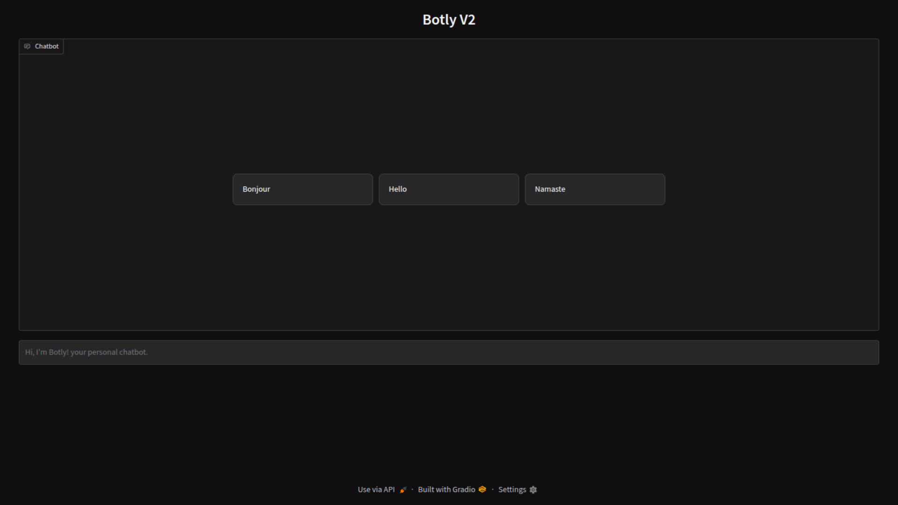

# **botly-v2**  

A Docker image for running [Ollama](https://ollama.com/) and [Gradio](https://www.gradio.app/) together. This setup provides an interactive AI environment with an intuitive web interface.

## **Features**  
✅ Preconfigured **Ollama** for AI model execution  
✅ Integrated **Gradio** for a user-friendly interface  
✅ **Dockerized** setup for easy deployment  
✅ **Customizable DNS** settings  

## **Prerequisites**  
Ensure you have:  
- **Docker** installed: [Install Docker](https://docs.docker.com/get-docker/)  

## **Installation**  

### **1. Build the Docker Image**  
Run the following command to build the image without using cache:  
```sh
sudo docker build --no-cache . -f Dockerfile -t botly:latest
```  

### **2. Run the Container**  
Start `botly` using Docker:  
```sh
sudo docker run --dns 8.8.8.8 -p 7861:7861 -it botly:latest
```  

Once started, the application will be accessible at:  
👉 **http://localhost:7861**  

## **Stopping the Container**  
To stop the running container:  
```sh
sudo docker stop $(sudo docker ps -q --filter ancestor=botly:latest)
```  

## **Logs & Debugging**  
View live logs from the running container:  
```sh
sudo docker logs -f $(sudo docker ps -q --filter ancestor=botly:latest)
```  


## **Demonstration Screenshots**
Below are some screenshots showcasing the application in action:


### Homepage



### Demo Chat


## **License**  
This project is open-source and available under the [MIT License](LICENSE).  

---

### **🚀 HAPPY CODING! 🎉**

